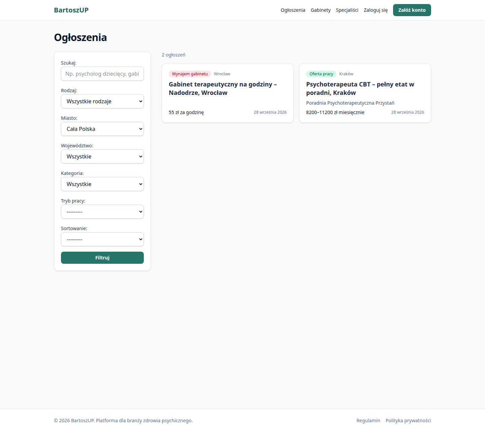
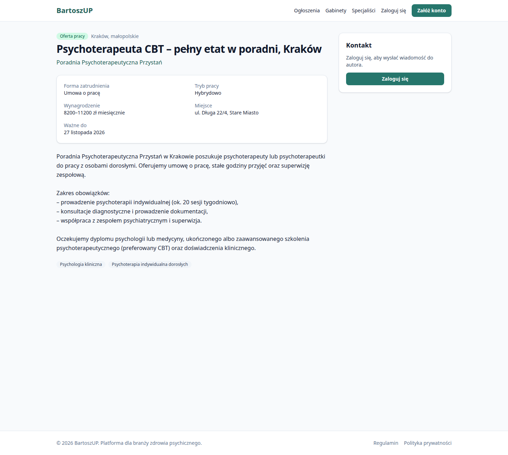
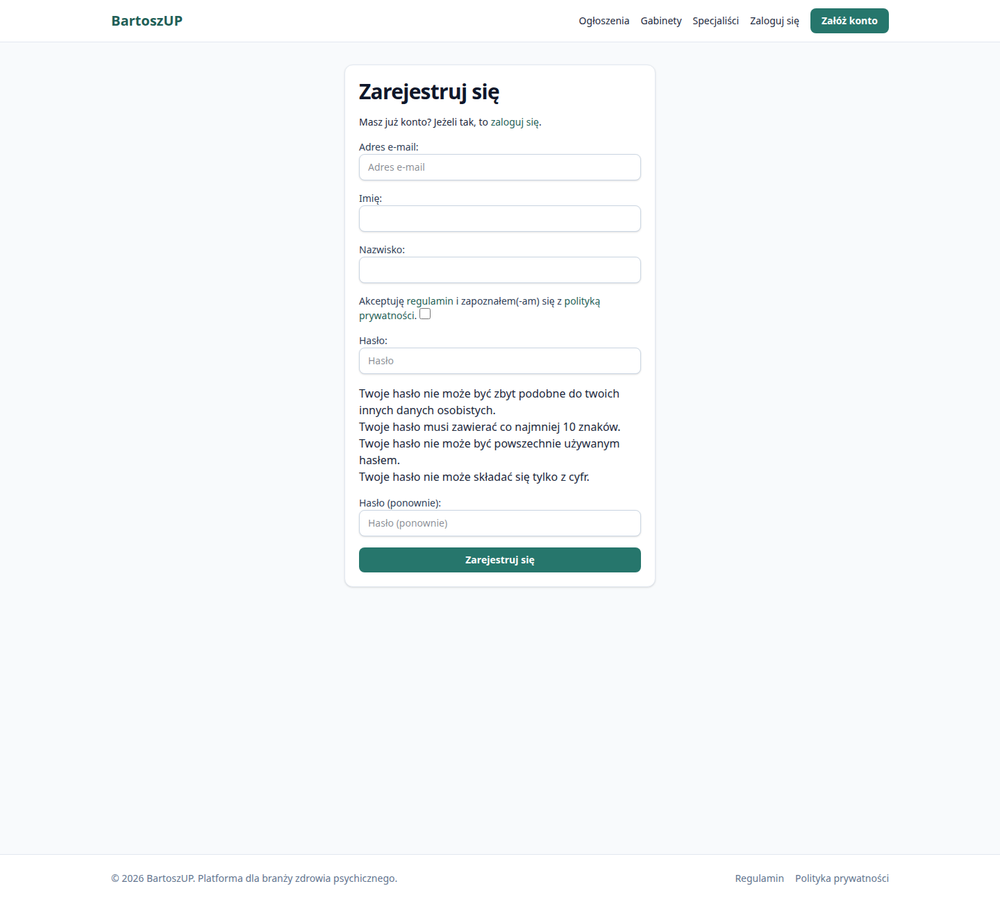

# BartoszUP

> **PL:** Platforma dla branży zdrowia psychicznego w Polsce: oferty pracy, staże, praktyki i
> wolontariaty dla psychologów i psychoterapeutów, ogłoszenia „szukam pracy”, wynajem gabinetów
> na godziny/dni oraz wizytówki specjalistów i placówek. Plan dla właściciela:
> [docs/roadmap.md](docs/roadmap.md).

## Podgląd

Zrzuty poniżej są z lokalnego uruchomienia. Darmowy adres do przeklikania powstaje z pliku `render.demo.yaml` (jedna darmowa usługa Docker, bez bazy i bez crona). Płatny start zostaje w `render.yaml` i nie służy do tego podglądu. To nie jest publiczne uruchomienie.


*strona główna*



*lista ogłoszeń*



*ogłoszenie o pracę*



*rejestracja*

BartoszUP is a Polish-language, server-rendered Django application with two MVP pillars:

1. **Job board**: job, internship and volunteering offers from clinics/NGOs/public institutions,
   plus "looking for work/internship" posts by specialists.
2. **Therapy-room rental** (hourly/daily) and **profile pages** ("wizytówki") for specialists and
   organizations.

Patient booking (B2C) is a later phase; the data model is prepared for it but nothing is built yet.

## Quickstart (5 commands)

Requirements: Docker with Compose v2.

```bash
git clone https://github.com/Tomekw2323/BartoszUP.git && cd BartoszUP
cp .env.example .env
docker compose up --build -d          # Postgres + Mailpit + app (migrates, loads reference data)
docker compose exec web python manage.py seed_demo        # optional demo data
docker compose exec web python manage.py createsuperuser  # admin at /admin/
```

Open <http://localhost:8000> (app) and <http://localhost:8025> (Mailpit, all outgoing email).
The admin is at `/admin/` locally; production uses a secret path (`DJANGO_ADMIN_URL`).
Demo users (after `seed_demo`): `anna@example.com`, `piotr@example.com`, `admin@example.com`, password `demo12345`.

### Without Docker for the app (faster feedback loop)

```bash
uv sync                                   # installs Python 3.13 deps incl. dev tools
docker compose up -d db                   # only Postgres
uv run python manage.py migrate && uv run python manage.py loaddata reference_data
uv run python manage.py tailwind runserver  # Django dev server + Tailwind watcher
```

## Everyday commands

| What | Command |
| --- | --- |
| Tests | `uv run pytest` (add `--cov` for coverage) |
| Lint + format | `uv run ruff check . && uv run ruff format .` |
| Types | `uv run mypy .` |
| Module boundaries | `uv run lint-imports` |
| All pre-commit hooks | `uv run pre-commit run --all-files` |
| New migrations | `uv run python manage.py makemigrations` |
| Daily maintenance | `uv run python manage.py daily_maintenance` (cron in prod) |
| Dependency audit | `uv run pip-audit` |

CI (GitHub Actions, `.github/workflows/ci.yml`) runs the same lint (incl. bandit security rules),
type, boundary, migration and test checks with a coverage floor, a dependency audit, and a
production Docker build.

## Render files (do not mix them up)

| File | What it is |
| --- | --- |
| [`render.yaml`](render.yaml) | Later **paid** launch: Frankfurt web service (Starter), Postgres (Basic 256 MB) and a cron job. Do not use this file for the free demo. |
| [`render.demo.yaml`](render.demo.yaml) | **Free demo only**: one Docker web service on Render's free plan, SQLite, no database and no cron. A banner says the data is made up. This is not the public launch. |

The demo settings module is `config.settings.demo`. It does not use `DATABASE_URL`. Production and local development stay on PostgreSQL (`config.settings.prod` / `config.settings.dev`).

## Tech stack

Python 3.13, Django 5.2 LTS, PostgreSQL 17, django-allauth (email + Google), django-filter,
HTMX 2, Tailwind CSS 4 (standalone CLI via `django-tailwind-cli`, no Node.js), WhiteNoise,
gunicorn. Tooling: uv, ruff, mypy + django-stubs, pytest + pytest-django + factory_boy,
import-linter, pre-commit. Decisions and their rationale: [docs/adr/](docs/adr/).

## Project structure

```
config/               Django project: settings (base/dev/test/prod/demo), urls, sitemaps, wsgi
apps/
  core/               Reference data: voivodeships, cities, specializations, therapy approaches
  accounts/           Custom User (email login), signup form
  organizations/      Organizations (clinics, NGOs, OPS...) and memberships with roles
  profiles/           Specialist profiles ("wizytówki")
  listings/           Listings (5 kinds), lifecycle, moderation, reports, inquiries, home + dashboard
  privacy/            GDPR: data export, account deletion, terms and privacy policy pages
templates/            Server-rendered HTML (Tailwind classes, HTMX partials start with "_")
assets/css/           Tailwind source; compiled to static/css/tailwind.css (git-ignored)
static/               Vendored JS (HTMX) and small page scripts
docs/                 Architecture, domain model, roadmap, deployment, ADRs
```

Each app keeps the same layout: `models.py`, `services.py` (use cases / public API for other
apps), `permissions.py` where relevant, `forms.py`, `filters.py`, `views.py`, `urls.py`,
`admin.py`, `tests/`.

## Documentation

- [Architecture](docs/architecture.md): context and container diagrams, module boundaries
- [Domain model](docs/domain-model.md): ER diagram, listing lifecycle, moderation
- [Roadmap](docs/roadmap.md) (PL): phases 1–3
- [Security](docs/security.md): threat model, controls, known gaps
- [Deployment](docs/deployment.md): Render (EU/Frankfurt) setup, env vars, GDPR notes
- [ADRs](docs/adr/): architecture decision records
- [CONTRIBUTING.md](CONTRIBUTING.md): branching, commits, PR flow
- [AGENTS.md](AGENTS.md): conventions for AI coding agents (Cursor rules in `.cursor/rules/`)
