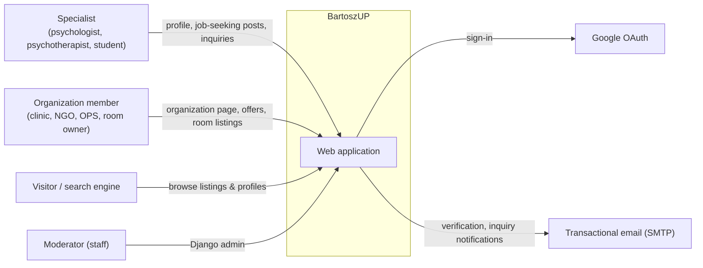
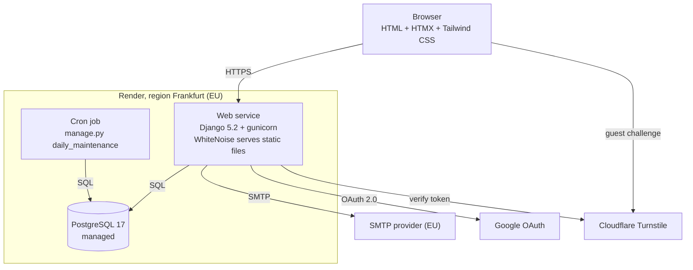
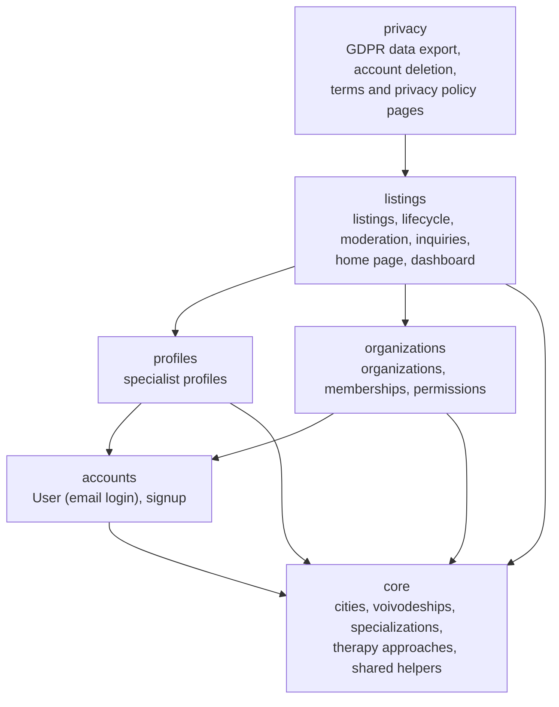

# Architecture

BartoszUP is a **modular monolith**: one Django project, one deployable, one PostgreSQL database,
split into Django apps with enforced, one-way dependencies. See
[ADR 0002](adr/0002-modular-monolith.md) for why this is not a microservice system.

## System context

## Containers

Locally the same topology runs via `docker-compose.yml`: `web` (Django dev server + Tailwind
watcher), `db` (Postgres) and `mailpit` (catches all email).

Requests are synchronous; there is no task queue yet. Email for inquiries is sent inline (a
failure is logged and recorded as `Inquiry.email_sent = False`, the inquiry itself is kept). A
queue (e.g. Celery or django-q2 on Redis/Postgres) is a Phase 2 item once volume or payments
require it.

## Modules and boundaries

Rules (enforced by **import-linter**, contract in `pyproject.toml`, run in CI and pre-commit):

1. An app may import only from apps **below** it: `privacy` → `listings` →
   `profiles | organizations` → `accounts` → `core`. `privacy` is on top because erasure and
   export must see every module's personal data.
2. `profiles` and `organizations` are **independent** siblings; neither imports the other.
3. Cross-module calls go through the lower module's **`services.py`** (e.g.
   `organizations.services.can_manage_organization`), not through its internal queries.
4. Foreign keys pointing "up" are not allowed. Pages of lower modules that need data from higher
   ones (e.g. an organization page showing its listings) get it via **template tags** of the
   higher module (`listings/templatetags/listing_tags.py`); templates are the composition layer.
5. `config/` (URLs, sitemaps) sits above all apps and may import any of them.

### Where things go inside an app

| File | Responsibility |
| --- | --- |
| `models.py` | Data, invariants (`clean`, DB constraints), small state transitions (`Listing.publish`) |
| `services.py` | Use cases spanning several objects or side effects (email, bulk updates); the app's public API |
| `permissions.py` | "Can user X do Y" as plain functions; views never inline permission logic |
| `forms.py` / `filters.py` | Input validation / list filtering (django-filter) |
| `views.py` | Thin: parse request → call permissions/services → render |
| `admin.py` | Moderation UI |

### Why these boundaries matter later

If one area ever needs to become a separate service (most likely **Phase 3 patient booking**,
because of GDPR art. 9 health data), the boundary already exists: it would talk to the rest via
the same `services.py` functions, turned into an API.

## Cross-cutting concerns

- **Auth**: django-allauth, email as the login, mandatory email verification in production,
  optional Google login (enabled when `GOOGLE_CLIENT_ID/SECRET` are set). See ADR 0008.
- **Authorization**: object-level checks in `permissions.py`/`services.py`. Organization owners
  and admins manage the organization and all its listings; plain members do not.
- **Security**: see [security.md](security.md) (threat model, OWASP Top 10 controls, rate limits,
  CSP). Verified email is required before publishing or contacting; guests use Turnstile.
- **Moderation**: post-moderation in Django admin, user reports with auto-hide (ADR 0012). `Listing.is_flagged`,
  `Organization.is_blocked`, `SpecialistProfile.is_blocked` hide content from public pages.
- **SEO**: server-rendered pages, canonical URLs, `/ogloszenia/<kind>/<city>/` landing pages
  (e.g. `/ogloszenia/gabinety/wroclaw/`), `sitemap.xml`, `robots.txt`, Polish slugs
  (`core.text.slugify_pl` handles "ł").
- **HTMX**: filter forms swap only the results block (`_listing_results.html`); every view also
  works without JavaScript.
- **i18n**: Polish-only UI, every string wrapped in gettext (ADR 0005).
- **Configuration**: 12-factor, all via environment variables (`django-environ`), see
  `.env.example`. Settings split: `base` → `dev` / `test` / `prod`.
- **Security**: `manage.py check --deploy` passes with prod settings (CI enforces it); HSTS,
  secure cookies, SSL redirect behind the proxy.
