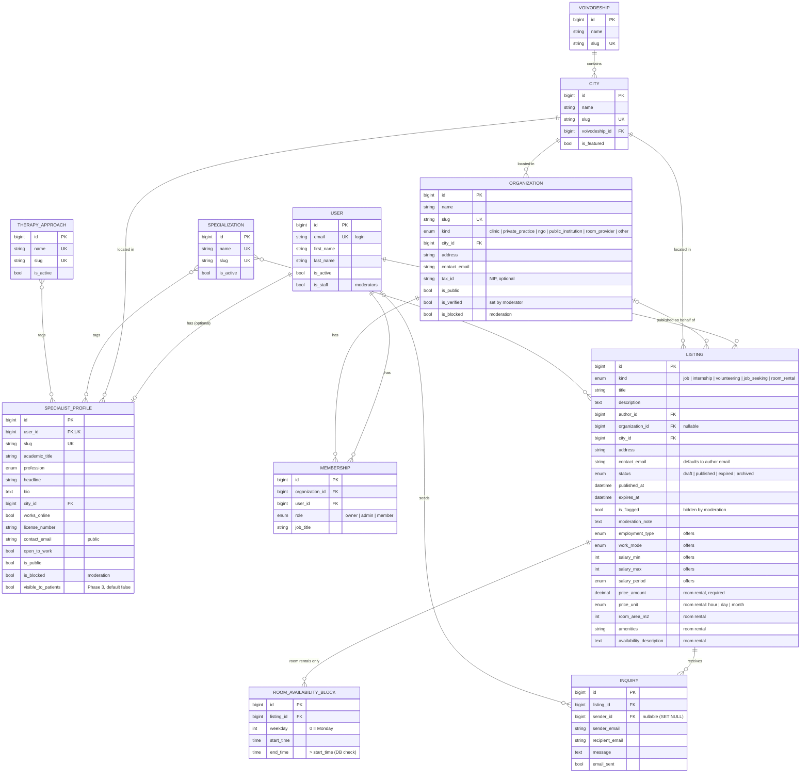
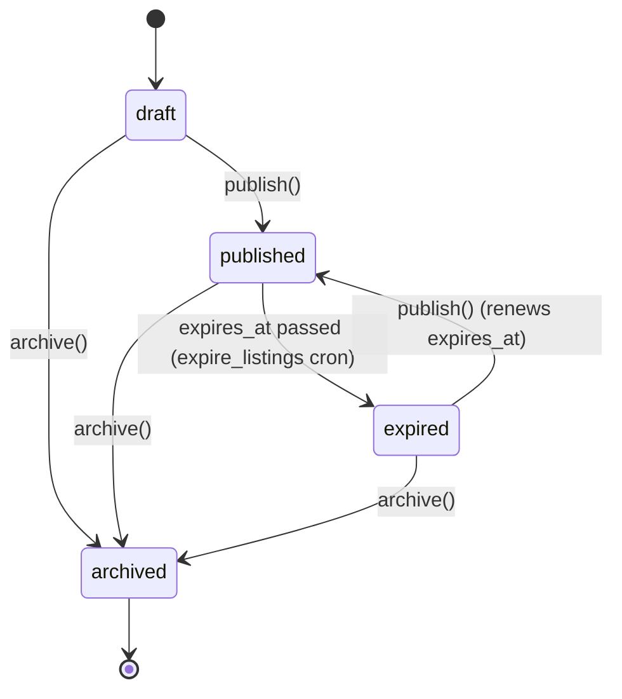

# Domain model

## Entity-relationship diagram

All non-reference tables also have `created_at` / `updated_at` (`core.TimeStampedModel`).

## Key decisions

- **One account type.** A `User` becomes a specialist by creating a `SpecialistProfile` and acts
  for a clinic through a `Membership`. The same person can do both (ADR 0007).
- **One `Listing` table for all five kinds** with nullable kind-specific columns, validated in
  `Listing.clean()` and `ListingForm.clean()` (irrelevant fields are cleared on save). One list
  page, one filter, one moderation queue (ADR 0006).
- **Reference data** (cities, voivodeships, specializations, therapy approaches) lives in `core`,
  is loaded from `apps/core/fixtures/reference_data.json` and edited in the admin. Entries are
  retired with `is_active = False`, never deleted (they are referenced with `PROTECT`).

## Listing lifecycle

- `publish()` sets `published_at = now` and `expires_at = now + LISTING_DEFAULT_LIFETIME_DAYS`
  (default 60).
- Public visibility is computed, not stored: **published, `expires_at` in the future, not
  flagged, organization not blocked** (`Listing.objects.public()` and
  `Listing.is_publicly_visible`). The cron job only tidies statuses; an overdue listing is hidden
  even before it runs.
- Invalid transitions raise `InvalidTransitionError`; the UI shows an error message.

## Moderation

Post-moderation (publish first, moderate after) to keep friction low for the MVP. Staff users
work in `/admin/`:

- `Listing.is_flagged` (+ `moderation_note`) hides a listing; bulk actions "hide"/"restore".
- `Organization.is_blocked` hides the organization and all its listings;
  `Organization.is_verified` shows a "verified" badge.
- `SpecialistProfile.is_blocked` hides a profile.

A user-facing "report this listing" button and a pre-moderation mode for new accounts are on the
roadmap.

## Permissions

| Action | Who |
| --- | --- |
| View public listing / profile / organization | Everyone |
| View draft/expired/flagged listing | Author, owners/admins of its organization |
| Create listing | Any signed-in user (for an organization: only its owner/admin) |
| Edit / publish / archive listing | Author, owners/admins of its organization |
| Send inquiry | Signed-in users, only for publicly visible listings that are not their own |
| Edit organization | Its owners/admins |
| Edit specialist profile | Its user |
| Moderate | Staff (Django admin) |

Code: `apps/listings/permissions.py`, `apps/organizations/services.py`. Tests:
`apps/listings/tests/test_permissions.py`, `apps/organizations/tests/`.

## Prepared for Phase 3 (patient booking), not built

- `SpecialistProfile` holds only **professional, publishable** data and is separate from `User`.
  Exposing it to patients means a new patient-facing view filtered by `visible_to_patients`
  (already in the schema, default `False`, not used by any view).
- Patients would be regular `User`s; bookings would live in a new `booking` app above
  `profiles`/`organizations` (e.g. `Service`, `Appointment`, `AvailabilitySlot`) so the existing
  modules do not change.
- **No health data is stored anywhere in the MVP.** Inquiries are B2B (job/room related). Phase 3
  will process special-category data (GDPR art. 9); see [roadmap](roadmap.md) and ADR 0009.
- `RoomAvailabilityBlock` (recurring weekly blocks) is the seed of the Phase 2 room calendar;
  concrete bookable slots will be a separate table referencing it.
