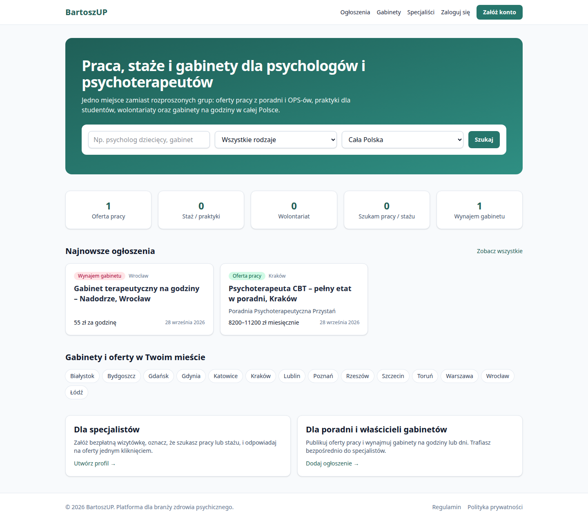

# Jak działa BartoszUP

Opis dla właściciela i partnera. Chodzi o to, co da się zrobić na stronie. Kod aplikacji na gałęzi `main` jest taki jak w `71a0980` (przewodniki doszły w `5d1d911`). Ten tekst dopowiada pytania, których pierwsza wersja nie zamykała.

BartoszUP to polska strona dla branży zdrowia psychicznego. Są na niej ogłoszenia (praca, staż, wolontariat, „szukam pracy”, wynajem gabinetu) oraz wizytówki specjalistów i organizacji.

Rezerwacji wizyt u specjalisty nie ma. Płatności nie ma. Zdjęć (logo, zdjęcie profilowe, zdjęcia gabinetu) nie ma. Kalendarza, w którym ktoś rezerwuje konkretną godzinę, nie ma — przy gabinecie widać tylko opis i ewentualnie stałe dni tygodnia.

Są dwie różne rzeczy. Ekrany wyglądają prawie tak samo: demo i gałąź `main` używają tych samych szablonów. Pełna wersja nie ma osobnego projektu graficznego. Nie ma w niej płatności ani rezerwacji wizyt — tak samo jak na demo.

| | Demo, które da się otworzyć | Pełna wersja (kod na `main`, nie wdrożona) |
| --- | --- | --- |
| Plik | `render.demo.yaml` | `render.yaml` |
| Adres | https://bartoszup-demo.onrender.com | W pliku jest przygotowany https://bartoszup.onrender.com. Tej wersji nie ma w internecie. |
| Pasek na górze | Żółty, na każdej stronie: „To jest demo. Dane są wymyślone i nie jest to prawdziwa usługa.” | Tego paska nie ma (`DEMO_MODE` wyłączone). |
| Dane | SQLite w kontenerze. Plan Free zasypia (zwykle po około 15 minutach bez wejść), dysk znika, przy starcie próbki wgrywają się od nowa. | PostgreSQL. Konta i ogłoszenia zostają. |
| Konta próbek | Trzy: `anna@example.com`, `piotr@example.com`, `ola@example.com`, hasło `demo12345`. Konta moderatora nie ma. | Brak próbek. Moderator wchodzi pod tajny adres, nie pod `/admin/`. |
| Poczta | Nie wychodzi do skrzynki. Świeża rejestracja nie potwierdzi e-maila, więc nie opublikuje ogłoszenia. | Ma wychodzić, gdy przy wdrożeniu ktoś wpisze serwer poczty. |
| Gość na ogłoszeniu | Bez kluczy Turnstile formularza nie ma. Widać „Zaloguj się, aby wysłać wiadomość do autora”. | Formularz gościa jest, gdy klucze Turnstile są wpisane. Bez kluczy zachowa się jak demo. |
| Cron | Nie ma. Ogłoszenie znika z listy po dacie, ale nikt nie uruchamia codziennego sprzątania. | `daily_maintenance`: wygaszenie po terminie, kasowanie starych wiadomości. |
| Płatności i wizyty pacjentów | Nie ma | Też nie ma. To późniejsze fazy, nie ten kod. |

### Co widać / czego nie widać

Zrzut poniżej to strona główna z lokalnego uruchomienia, czyli wygląd `main` przy wyłączonym demo. Na żywym demo jest ten sam układ, a nad menu dochodzi żółty pasek.

| Co widać | Czego nie widać |
| --- | --- |
| Strona główna, lista, ogłoszenie, wizytówka, rejestracja — ten sam układ co na `main`. | Innego wyglądu „pełnej wersji”. Osobnego projektu ekranów nie ma. |
| Żółty pasek tylko na demo. | Trwałych danych. Po uśpieniu SQLite jest puste i próbki wracają od nowa. |
| Trzy konta próbek i ich ogłoszenia. | Maila w skrzynce. Na demo nic nie wychodzi. |
| Zamiast formularza gościa: prośba o zalogowanie. | Turnstile, crona i panelu moderatora. To jest w `render.yaml`, a to wdrożenie nie stoi. |
| Ceny na ogłoszeniach (widełki, 45 zł za godzinę) jako tekst do przeczytania. | Płatności w serwisie i rezerwacji wizyty. Tego nie ma ani na demo, ani w kodzie pełnej wersji. |

## Co jest w menu

Na każdej stronie, od lewej:

- **BartoszUP** — strona główna.
- **Ogłoszenia** — lista wszystkich aktualnych ogłoszeń.
- **Gabinety** — ta sama lista, od razu ustawiona na wynajem gabinetu.
- **Specjaliści** — wizytówki.
- Gość widzi **Zaloguj się** i **Załóż konto**.
- Zalogowana osoba widzi **Mój panel**, **Dodaj ogłoszenie** i **Wyloguj**.

Na dole: **Regulamin**, **Polityka prywatności**, a po zalogowaniu także **Moje dane**.

Strona jest po polsku, adresy też. Osobnej aplikacji na telefon nie ma. To strona w przeglądarce: na wąskim ekranie kafelki schodzą jeden pod drugim.

## Tematy z grupy na Facebooku

Na zrzucie grupy, w „Informacje”, jest pięć tematów. Przycisk „Wyświetl mnie” na tym zrzucie rozwija opis na Facebooku. Na stronie takiego przycisku nie ma.

Słowo „prywatne” na stronie znaczy co innego niż na grupie. Ogłoszenie prywatne to ogłoszenie bez organizacji, dodane w imieniu osoby. Po publikacji widzą je wszyscy. To nie jest wpis tylko dla znajomych.

Pod ogłoszeniem nie ma wątku komentarzy ani reakcji. Zamiast dyskusji jest formularz wiadomości, a odpowiedź idzie mailem. Wpis na grupie wisi, dopóki ktoś go nie skasuje. Tutaj opublikowane ogłoszenie znika z listy po 60 dniach (da się je opublikować ponownie).

### Oferty pracy, zlecenia i B2B

To jest rodzaj **Oferta pracy** (kafelek na stronie głównej i adres `/ogloszenia/praca/`). Dodaje go osoba albo organizacja.

B2B nie jest osobną tablicą. W formularzu, w polu „forma zatrudnienia”, są: umowa o pracę, B2B, umowa zlecenie / o dzieło, bezpłatne, inna. Filtr listy nie ma pozycji „tylko B2B”. Szukaj patrzy w tytuł i opis, nie w to pole. Napis „B2B” widać na stronie ogłoszenia, przy „Forma zatrudnienia”, a na liście tylko wtedy, gdy autor wpisze to słowo w tytule albo opisie.

Osobnej tablicy „zlecenia” nie ma. Krótkie zlecenie to oferta pracy z formą B2B, „umowa zlecenie / o dzieło” albo „inna”. Że chodzi o jednorazowy projekt albo zastępstwo, pisze się w opisie. Nie ma pól „od dnia” i „do dnia” ani znacznika „zlecenie jednorazowe”.

Próbki na demo są na umowę o pracę, nie na B2B. Żeby pokazać partnerowi B2B, zaloguj się jako Piotr (konto niżej) i dodaj takie ogłoszenie w trakcie rozmowy. Zostanie do uśpienia demo.

### Staże, praktyki i wolontariaty

W grupie to jeden temat. Na stronie to dwa rodzaje, dwa kafelki:

- **Staż / praktyki** (`/ogloszenia/staze/`) — formularz jak przy pracy, łącznie z widełkami. Da się wybrać „bezpłatne”.
- **Wolontariat** (`/ogloszenia/wolontariat/`) — zostaje tryb pracy: stacjonarnie, hybrydowo albo zdalnie. Widełki przy zapisie znikają.

Oba dodaje osoba albo organizacja. To ogłoszenie od strony, która przyjmuje (poradnia szuka praktykanta). Osoba, która sama szuka stażu, używa „Szukam pracy / stażu”.

### Podnajem gabinetów

Rodzaj **Wynajem gabinetu**, w menu **Gabinety** (`/ogloszenia/gabinety/`). Dodaje go osoba (własne godziny, bez organizacji) albo organizacja. Rodzaj organizacji „wynajmujący gabinety” jest podpisem na stronie organizacji. Formularz ogłoszenia jest taki sam jak przy poradni.

Jedno ogłoszenie ma jedną cenę i jedną jednostkę: za godzinę, za dzień albo za miesiąc. Cena jest obowiązkowa. Godzina i stały miesiąc naraz to dwa ogłoszenia. Jednostki „za blok” nie ma.

„Bloki” to osobna rzecz: do 21 powtarzających się okien w tygodniu, dzień tygodnia plus od–do (na przykład wtorek 16:00–21:00). Konkretnej daty, na przykład 3 października, wpisać się nie da. Godzina końca musi być późniejsza niż początku. Dwa okna mogą na siebie nachodzić — strona tego nie sprawdza, bo nikt ich nie rezerwuje. Obok jest zwykły opis dostępności. To informacja dla czytelnika, nie kalendarz.

Stałej wyłączności nie ma jako trybu. Najbliżej jest cena za miesiąc i zdanie w opisie („wyłączność na cały tydzień”). Nie ma znacznika „zajęte”, „na wyłączność” ani daty końca umowy.

Jedno ogłoszenie to jeden gabinet: metraż, wyposażenie, adres albo dzielnica. Listy kilku sal w jednym ogłoszeniu nie ma. Zdjęć nie ma.

Na demo jest jeden gabinet: 45 zł za godzinę, centrum Wrocławia, wtorki i czwartki 16:00–21:00, soboty 9:00–15:00. Ceny za dzień i za miesiąc w próbkach nie ma. Da się je dodać kontem Piotra, dopóki demo nie zaśnie.

Pieniądze za wynajem ludzie ustalają poza stroną. Na stronie nikt nie płaci i nikt nie klika godziny, żeby ją zająć.

### Szukam pracy i szukam gabinetu

Rodzaj **Szukam pracy / stażu** (`/ogloszenia/szukam-pracy/`) dodaje się tylko jako osoba. Organizacji wybrać się nie da. W formularzu są forma zatrudnienia i tryb pracy. Widełek nie ma.

Rodzaju „szukam gabinetu do wynajęcia” nie ma. **Gabinety** pokazują oferty wynajmujących, nie osoby szukające sali. Zdanie „szukam gabinetu” można wpisać w „o mnie” na wizytówce albo w opisie ogłoszenia „szukam pracy”. Fraza z tytułu albo opisu wpadnie w wyszukiwarkę. Nie powstanie z tego kategoria, filtr ani odznaka. Kratka na profilu nazywa się „szukam pracy / współpracy”.

Pliku CV nie ma gdzie wgrać. Żaden formularz nie przyjmuje plików. Zamiast CV jest wizytówka: nagłówek, „o mnie”, zawód, miasto, specjalizacje, języki i numer uprawnień albo certyfikatu. Numer to zwykły tekst. Nikt nie sprawdza go w rejestrze.

### Wizytówki i oferty dla pacjentów

Wizytówki są, w menu **Specjaliści**. Służą branży: poradnia może znaleźć osobę z odznaką „Szuka pracy / współpracy” i zobaczyć jej ogłoszenia dodane prywatnie.

Katalogu „Znajdź psychologa” nie ma. Nie ma cennika sesji, napisu „przyjmuję pacjentów”, umawiania wizyty ani osobnego konta pacjenta. Pole „widoczny dla pacjentów” jest w bazie, domyślnie wyłączone, żaden formularz go nie pokazuje i żadna strona go nie używa.

Lista specjalistów jest w internecie publiczna. Pacjent może ją otworzyć i przeczytać to, co specjalista sam wpisał. To nadal wizytówka branżowa, nie oferta dla pacjentów. Kontakt na wizytówce to mailto, telefon i strona www, jeśli te pola są wypełnione. Formularza wiadomości na wizytówce nie ma — jest tylko przy ogłoszeniu.

Polityka prywatności mówi wprost, że serwis nie przetwarza danych o zdrowiu pacjentów. Wiadomość „chcę wizytę” wpisana w ogłoszenie o pracę nie jest funkcją serwisu.

Wylogowanie działa przyciskiem (to wysłanie formularza). Samo wejście w adres wylogowania nic nie robi.

## Strona główna

Wyszukiwarka na górze: wpisujesz frazę, wybierasz rodzaj ogłoszenia i miasto, klikasz **Szukaj**. Trafiasz na listę ogłoszeń z tymi filtrami.

Pod spodem pięć kafelków z liczbą aktualnych ogłoszeń. Kliknięcie kafla otwiera listę tylko tego rodzaju:

- Oferta pracy
- Staż / praktyki
- Wolontariat
- Szukam pracy / stażu
- Wynajem gabinetu

Dalej jest do sześciu najnowszych ogłoszeń i odnośniki do wyróżnionych miast (między innymi Warszawa, Kraków, Wrocław, Gdańsk, Poznań — łącznie 14 miast). Kliknięcie miasta pokazuje ogłoszenia z tego miasta.

Dwa kafelki na dole prowadzą do utworzenia profilu i do dodania ogłoszenia. Bez konta z potwierdzonym e-mailem te strony zatrzymają się na logowaniu albo na prośbie o potwierdzenie adresu.

## Gość (osoba bez konta)

Gość może:

- czytać stronę główną, listę ogłoszeń, pojedyncze ogłoszenie, listę specjalistów, wizytówkę i stronę organizacji;
- używać filtrów;
- otworzyć regulamin i politykę prywatności;
- założyć konto albo się zalogować.

Gość nie widzi szkiców, ogłoszeń po terminie, ogłoszeń ukrytych przez moderację ani stron zablokowanych organizacji i profili. Wejście w takie ogłoszenie kończy się stroną „nie znaleziono”.

### Kontakt bez konta

Na pełnej wersji, gdy są włączone klucze Cloudflare Turnstile, gość na ogłoszeniu widzi formularz: imię i nazwisko, e-mail, treść, kratkę „nie jestem robotem” i przycisk **Wyślij wiadomość**. Wiadomość idzie mailem do autora. Autor dostaje też adres nadawcy, żeby móc odpisać. Adres autora nie wraca do gościa w treści strony.

Na demo kluczy Turnstile nie ma. Gość widzi tekst „Zaloguj się, aby wysłać wiadomość do autora” i przycisk **Zaloguj się**.

Gość nie może dodać ogłoszenia, profilu ani organizacji i nie może zgłosić ogłoszenia.

## Konto

**Załóż konto** (`/konto/signup/`) pyta o:

- adres e-mail (to jest login; nazwy użytkownika nie ma),
- hasło i powtórzenie hasła (co najmniej 10 znaków; hasło nie może być zbyt proste ani samym ciągiem cyfr),
- imię i nazwisko,
- zaznaczenie „Akceptuję regulamin i zapoznałem(-am) się z polityką prywatności”.

Bez zaznaczenia zgody konto nie powstanie. Data zgody zostaje zapisana.

**Zaloguj się** (`/konto/login/`) — e-mail i hasło. Po udanym logowaniu otwiera się **Mój panel**.

Jest też odzyskanie hasła i zmiana hasła oraz strona adresów e-mail (`/konto/email/`, link ze strony **Moje dane**).

Logowanie Google jest w kodzie. Pojawia się dopiero wtedy, gdy przy wdrożeniu ktoś wpisze klucze Google. Na demo ich nie ma, więc przycisku Google nie widać.

Za dużo prób (rejestracja, złe hasło, reset hasła) kończy się odmową na jakiś czas. Przy zbyt wielu operacjach na stronie widać „Zbyt wiele prób”.

### Potwierdzenie e-maila

Na pełnej wersji potwierdzenie jest obowiązkowe już przy rejestracji: przychodzi mail, klikasz link, dopiero wtedy wchodzisz dalej. Bez tego nie opublikujesz ogłoszenia, nie utworzysz profilu ani organizacji i nie wyślesz wiadomości.

Na demo mail nie dochodzi do skrzynki (trafia tylko do dziennika serwera). Możesz założyć konto i zostać zalogowany, ale dodanie ogłoszenia, profilu, organizacji albo zgłoszenia zatrzymuje się na stronie z prośbą o potwierdzenie adresu — a linka w skrzynce nie będzie. Wiadomość do autora pokazuje po polsku: „Potwierdź adres e-mail, aby wysyłać wiadomości.”

Żeby na demo przejść te kroki, zaloguj się gotowym kontem z listy niżej. Te trzy adresy są już potwierdzone.

## Mój panel

Po zalogowaniu **Mój panel** (`/panel/`) pokazuje trzy rzeczy:

1. **Profil specjalisty** — jeśli go nie ma, przycisk **Utwórz profil**. Jeśli jest, widać imię, zawód i miasto, a gdy profil jest ukryty, dopisek „Profil jest ukryty”. **Edytuj profil** otwiera formularz.
2. **Moje organizacje** — tylko te, w których jesteś właścicielem albo administratorem. Przy każdej jest **edytuj**. Na dole **Dodaj organizację**. Zwykły członek zespołu tej listy nie widzi.
3. **Ogłoszenia** — twoje oraz ogłoszenia organizacji, którymi zarządzasz. W tabeli: tytuł, rodzaj, status, data wygaśnięcia i przyciski **Edytuj**, **Opublikuj** (przy szkicu i wygasłym), **Archiwizuj** (dopóki nie jest w archiwum) i **Usuń**.

Pod spodem jest link **Moje dane i usuwanie konta (RODO)**.

## Profil specjalisty

Jeden profil na konto. Ścieżka: **Mój panel** → **Utwórz profil** albo **Edytuj profil** (`/specjalisci/moj-profil/`). Trzeba mieć potwierdzony e-mail.

W formularzu:

- imię i nazwisko (z konta),
- tytuł (na przykład mgr, dr),
- zawód: psycholog, psychoterapeuta, psychoterapeuta w trakcie szkolenia, psychiatra, seksuolog, coach / trener, student(ka) psychologii, inny,
- nagłówek (jedno zdanie, widać je na liście),
- „o mnie”,
- miasto,
- „pracuję online”,
- specjalizacje (kratki, na przykład psychologia dzieci i młodzieży, uzależnienia, interwencja kryzysowa — jest ich 23),
- nurty (na przykład CBT, psychodynamiczny, Gestalt, EMDR — jest ich 16),
- języki, numer uprawnień lub certyfikatu,
- publiczny e-mail, telefon, strona www,
- „szukam pracy / współpracy”,
- „profil widoczny publicznie”.

**Zapisz** wraca do panelu i pokazuje „Profil został zapisany.”

Publiczna wizytówka (`/specjalisci/…`) pokazuje te dane, odznakę „Szuka pracy / współpracy”, jeśli jest zaznaczona, oraz ogłoszenia tej osoby dodane prywatnie (bez organizacji). Kontakt to mailto, telefon i link — osobnego formularza na wizytówce nie ma. Właściciel widzi **Edytuj profil**.

### Student i CV

Ścieżka studenta, który na grupie wrzucałby CV:

1. Konto z potwierdzonym e-mailem.
2. Profil. W zawodzie jest „student(ka) psychologii”. Nagłówek i „o mnie” zastępują CV. Kratka „szukam pracy / współpracy” wyróżnia profil na liście specjalistów (filtr „szuka pracy”).
3. Ogłoszenie rodzaju **Szukam pracy / stażu**, bez organizacji. W opisie: rok studiów, od kiedy, jakie praktyki.

Nie ma przycisku „aplikuj jednym kliknięciem” ani załącznika. Poradnia pisze przez formularz na ogłoszeniu studenta albo student pisze na ogłoszeniu poradni. Na demo ta osoba jest gotowa: `ola@example.com` (niżej). Piotr, właściciel poradni, profilu specjalisty nie ma — konto może mieć profil i organizację naraz, ale w próbkach Piotr ma tylko organizacje.

Odznaczenie „profil widoczny publicznie” chowa wizytówkę przed innymi (wejście w adres daje „nie znaleziono”). W panelu profil zostaje i da się go z powrotem włączyć.

Pole „widoczny dla pacjentów” jest w bazie i domyślnie wyłączone. Żaden formularz go nie pokazuje i żadna strona dla pacjentów go nie używa.

### Lista specjalistów

**Specjaliści** (`/specjalisci/`). Filtry po lewej: szukaj (nagłówek, opis, imię, nazwisko), miasto, zawód, specjalizacja, nurt, „szuka pracy”. Przycisk **Filtruj**. Zmiana filtra odświeża listę od razu, gdy przeglądarka ma włączony JavaScript; bez JavaScriptu wystarczy **Filtruj**. Na stronie jest 20 osób.

Na liście nie ma profili ukrytych, zablokowanych przez moderację ani profili osób z wyłączonym kontem.

## Organizacje

Organizacji nie ma na osobnej liście w menu. Stronę organizacji otwierasz z ogłoszenia (nazwa pod tytułem) albo z panelu, jeśli nią zarządzasz.

**Dodaj organizację** (z panelu, potwierdzony e-mail, najwyżej 5 organizacji dziennie na konto). Formularz:

- nazwa, rodzaj (poradnia / klinika, gabinet prywatny, fundacja / stowarzyszenie, instytucja publiczna, wynajmujący gabinety, inna),
- miasto, adres, opis,
- strona, e-mail, telefon, NIP,
- „widoczna publicznie”.

Po zapisie jesteś **właścicielem**. Strona organizacji pokazuje opis, odznakę **Zweryfikowana** tylko gdy moderator ją nada, aktualne ogłoszenia tej organizacji oraz kontakt (adres, mailto, telefon, www). Listy zespołu na tej stronie nie ma. Właściciel i administrator widzą **Edytuj organizację** i **Dodaj ogłoszenie**.

### Co klika poradnia

Rodzaj „poradnia / klinika” jest podpisem. To samo potrafi gabinet prywatny, fundacja, OPS i „wynajmujący gabinety”: jedna strona, te same ogłoszenia. NIP jest zwykłym polem. Samo wpisanie NIP nie daje odznaki **Zweryfikowana** i nie sprawdza firmy w żadnym rejestrze.

Poradnia, która chce zastąpić post na grupie:

1. Konto z potwierdzonym e-mailem, **Dodaj organizację**, rodzaj poradnia / klinika, miasto ze słownika.
2. **Dodaj ogłoszenie** i w liście „w imieniu organizacji” wybrać tę poradnię. Puste pole to ogłoszenie osoby, nie poradni.
3. Oferta pracy (w tym B2B albo umowa zlecenie), osobno staż, osobno wolontariat, osobno wynajem gabinetu. Jedna osoba może mieć przy tym własny profil specjalisty.

Wiadomości z ogłoszenia poradni idą na e-mail wpisany w tym ogłoszeniu. Puste pole oznacza e-mail autora ogłoszenia (osoby zalogowanej), nie e-mail kontaktowy organizacji ze strony poradni. W panelu nie ma wspólnej skrzynki dla zespołu.

### Role

| Rola | Co może |
| --- | --- |
| Właściciel | Edytować organizację i jej ogłoszenia, dodawać ogłoszenia w jej imieniu. |
| Administrator | To samo. |
| Członek zespołu | Nic z tego na stronie. Nie widzi organizacji w panelu i nie może publikować w jej imieniu. |

Na stronie nie ma zaproszeń ani zmiany ról. Recepcji ani drugiego psychologa nie dopiszesz z panelu. Dopisanie drugiej osoby robi moderator w ukrytym panelu administracyjnym. W demo gotowe role są tylko w przykładowych danych. Pole „stanowisko” przy członkostwie jest w bazie; formularz na stronie go nie pokazuje.

Odznaczenie „widoczna publicznie” chowa stronę organizacji. Sam znacznik „zweryfikowana” i „zablokowana” ustawia tylko moderator — w formularzu ich nie ma.

Zablokowana organizacja znika z sieci razem ze swoimi ogłoszeniami. Osoby, które nią zarządzają, nadal widzą ją w panelu.

## Ogłoszenia

Pięć rodzajów, jedna lista.

| Rodzaj | Adres listy | Kto to zwykle dodaje | Co jest w formularzu poza tytułem, opisem, miastem i kategoriami |
| --- | --- | --- | --- |
| Oferta pracy | `/ogloszenia/praca/` | Osoba albo organizacja | Forma zatrudnienia, tryb pracy, widełki w PLN, okres (za godzinę / za sesję / miesięcznie) |
| Staż / praktyki | `/ogloszenia/staze/` | Osoba albo organizacja | Jak przy pracy |
| Wolontariat | `/ogloszenia/wolontariat/` | Osoba albo organizacja | Tryb pracy |
| Szukam pracy / stażu | `/ogloszenia/szukam-pracy/` | Tylko jako osoba prywatna | Forma zatrudnienia i tryb pracy. Organizacji wybrać się nie da. |
| Wynajem gabinetu | `/ogloszenia/gabinety/` | Osoba albo organizacja | Cena w PLN (obowiązkowa), jednostka: za godzinę, za dzień albo za miesiąc (obowiązkowa), metraż, wyposażenie, opis dostępności, do 21 stałych bloków „dzień tygodnia + od–do” |

Wspólne pola: tytuł, opis, miasto, adres lub dzielnica, kategorie (te same specjalizacje co przy profilu), e-mail do kontaktu. Pusty e-mail oznacza, że wiadomości idą na adres autora.

Forma zatrudnienia: umowa o pracę, B2B, umowa zlecenie / o dzieło, bezpłatne, inna. Tryb: stacjonarnie, hybrydowo, zdalnie.

### Dodawanie

**Dodaj ogłoszenie** wymaga konta z potwierdzonym e-mailem. Limit: 10 nowych ogłoszeń na godzinę i 50 na dobę.

1. Wybierasz rodzaj. Pola niepasujące do rodzaju chowają się (przy włączonym JavaScript) i przy zapisie są czyszczone.
2. Jeśli zarządzasz organizacją, pojawia się lista „w imieniu organizacji”. Pusto znaczy ogłoszenie prywatne. Na liście są tylko organizacje, w których jesteś właścicielem albo administratorem.
3. **Zapisz** zostawia szkic (albo, przy edycji już opublikowanego, zostawia je opublikowane i nie przedłuża terminu).
4. **Zapisz i opublikuj** jest przy nowym ogłoszeniu, szkicu i wygasłym. Ogłoszenie od razu widać na liście. Termin: 60 dni od tej chwili.

Komunikat: „Ogłoszenie zostało opublikowane.” albo „Ogłoszenie zostało zapisane.”

### Co widać na liście i na stronie ogłoszenia

Karta: rodzaj, miasto, „Zdalnie” gdy tak ustawiono, tytuł, nazwa organizacji, cena albo widełki, data publikacji.

Strona ogłoszenia: rodzaj, miasto i województwo, tytuł, link do organizacji albo do wizytówki autora (gdy ogłoszenie jest prywatne i autor ma publiczny profil), dane zależne od rodzaju, opis, kategorie, „ważne do”.

Przy gabinecie: cena, metraż, adres, wyposażenie, lista bloków (na przykład „Wtorek 16:00–21:00”) i opis dostępności. To jest informacja, nie rezerwacja. Nikt nie klika godziny i nie płaci. Szczegóły godzin, dni, miesiąca i wyłączności są w sekcji „Podnajem gabinetów” wyżej.

### Statusy

| Status | Kto widzi | Co da się kliknąć |
| --- | --- | --- |
| Szkic | Autor oraz właściciel/administrator organizacji | **Opublikuj** albo **Archiwizuj** |
| Opublikowane | Wszyscy, dopóki nie minął termin i moderacja go nie ukryła | **Archiwizuj**. Edycja nie zdejmuje go z listy. |
| Wygasłe | Jak szkic (publicznie znika, gdy minie data, nawet zanim status zdąży się zmienić) | **Opublikuj** — liczy nowe 60 dni |
| Zarchiwizowane | Jak szkic | Nie da się przywrócić. Zostaje **Usuń**. |

**Usuń** jest schowane pod napisem **Usuń**. Drugi przycisk to **Potwierdzam usunięcie**. Ogłoszenie znika na stałe. Do usunięcia wystarczy zalogowanie i prawo do tego ogłoszenia (autor albo właściciel/administrator organizacji).

Prawo do edycji ma autor oraz właściciel i administrator organizacji, w której imieniu ogłoszenie wisi. Zwykły członek zespołu i obca osoba dostają odmowę.

## Filtry ogłoszeń

Na `/ogloszenia/` po lewej:

- Szukaj — szuka w tytule i opisie (przykład z podpowiedzi: „psycholog dziecięcy, gabinet”),
- Rodzaj,
- Miasto (albo „Cała Polska”),
- Województwo (16 województw, 54 miasta w słowniku),
- Kategoria,
- Tryb pracy,
- Sortowanie: najnowsze, cena rosnąco, cena malejąco. Cena w tym sortowaniu to cena gabinetu. Widełki pensji nie układają listy.

Miasto przy dodawaniu ogłoszenia, profilu i organizacji wybiera się ze słownika: 16 województw, 54 miasta. Własnej miejscowości wpisać się nie da. Dzielnicę albo adres dopisuje się obok, zwykłym tekstem. Miasta spoza listy dodaje moderator w panelu administracyjnym. Nowe wgranie słownika z pliku nadpisuje takie poprawki.

„Cała Polska” w filtrze znaczy: nie zawężaj do miasta. Przy dodawaniu ogłoszenia takiego miasta nie ma. Trzeba wybrać jedno miasto, także przy pracy zdalnej (tryb „zdalnie” jest osobnym polem). Na profilu „pracuję online” też nie zastępuje miasta.

Na stronie głównej wyróżnione są: Wrocław, Bydgoszcz, Toruń, Lublin, Łódź, Kraków, Warszawa, Rzeszów, Białystok, Gdańsk, Gdynia, Katowice, Poznań, Szczecin.

**Filtruj** działa też bez JavaScriptu. Z JavaScriptem lista podmienia się przy zmianie pola. Strona mieści 20 ogłoszeń, na dole jest paginacja.

Te same listy mają krótkie adresy, na przykład `/ogloszenia/gabinety/wroclaw/` albo `/ogloszenia/praca/`. Na stronie ogłoszenia kliknięcie rodzaju albo miasta prowadzi właśnie tam.

## Kontakt przy ogłoszeniu

Ramka **Kontakt**:

- Autor (albo osoba zarządzająca organizacją) widzi, na jaki adres przyjdą wiadomości. Sam do siebie nie pisze.
- Zalogowana osoba z potwierdzonym e-mailem, która nie jest autorem, pisze treść i klika **Wyślij wiadomość**. Limit: 10 na godzinę na konto i 30 na godzinę z jednego adresu internetowego.
- Gość — tylko gdy włączony jest Turnstile (patrz wyżej). Limit gościa: 3 na godzinę i 10 na dobę z jednego adresu.

Po wysłaniu: „Wiadomość została wysłana do autora ogłoszenia.” Autor dostaje maila z imieniem, adresem i treścią. Odpowiedź to zwykła odpowiedź na tego maila. Gdy wysyłka maila się nie uda, wiadomość i tak zostaje zapisana u nas.

Skrzynki w **Moim panelu** nie ma. Historii korespondencji na stronie nie poczytasz. Treść jest w mailu, w bazie oraz w pliku **Pobierz dane** (wysłane oraz odebrane przy ogłoszeniach, których jesteś autorem). Ogłoszenia organizacji, których nie jesteś autorem, do tego pliku nie wchodzą, nawet gdy jesteś właścicielem poradni. Na demo mail do skrzynki nie dochodzi. Żeby w trakcie rozmowy z partnerem zobaczyć treść, autor klika **Pobierz dane** i podaje hasło jeszcze raz. Po uśpieniu demo ten plik i tak powstaje od nowa, bez tamtej wiadomości.

Na pełnej wersji stare wiadomości są kasowane po 365 dniach (codzienne zadanie). Na demo tego zadania nie ma.

## Zgłoszenie ogłoszenia

Zalogowana osoba z potwierdzonym e-mailem, która nie jest autorem, na publicznym ogłoszeniu rozwija **Zgłoś ogłoszenie**. Wybiera powód:

- spam lub reklama,
- podejrzenie oszustwa,
- treści nieodpowiednie lub nieetyczne,
- nieaktualne ogłoszenie,
- inny powód,

dopisuje szczegóły i klika **Wyślij zgłoszenie**. Komunikat: „Dziękujemy, zgłoszenie trafi do moderacji.” Drugie zgłoszenie tego samego ogłoszenia przez tę samą osobę kończy się informacją, że już je zgłosiła. Limit: 10 zgłoszeń na godzinę.

Trzy nierozpatrzone zgłoszenia od różnych osób ukrywają ogłoszenie samo. Znika z listy, dopóki moderator go nie przywróci.

## Moderacja

Moderator to osoba z uprawnieniem pracownika w panelu Django. Na pełnej wersji ten panel nie jest pod adresem `/admin/` — adres ustala się przy wdrożeniu i ma być nie do zgadnięcia. Na demo panel jest pod `/admin/`, ale nie ma gotowego konta moderatora (przykładowy administrator powstaje tylko przy lokalnym ładowaniu danych, nie na publicznym demo).

Moderator może:

- ukryć ogłoszenie albo je przywrócić (akcje „Ukryj zaznaczone” / „Przywróć zaznaczone”),
- oznaczyć zgłoszenia jako rozpatrzone (samo oznaczenie nie przywraca ogłoszenia — ukrycie zdejmuje się osobno),
- zablokować organizację (znika ona i jej ogłoszenia) albo profil specjalisty,
- nadać organizacji odznakę **Zweryfikowana**,
- dopisać członkostwo i rolę,
- poprawiać słownik miast, specjalizacji i nurtów.

Ogłoszenie idzie na stronę od razu po publikacji. Nikt go nie zatwierdza z góry. Potwierdzony e-mail znaczy, że ktoś kliknął link w mailu. Nie znaczy, że to psycholog. Numer uprawnień na profilu nikt nie porównuje z rejestrem. Odznaka **Zweryfikowana** przy organizacji to ręczna decyzja moderatora, bez wgrywania dokumentów.

Zablokowanie profilu chowa wizytówkę. Nie chowa automatycznie prywatnych ogłoszeń tej osoby. Żeby zniknęły, moderator ukrywa każde ogłoszenie albo osoba je archiwizuje. Zablokowanie organizacji chowa ją i jej ogłoszenia.

Trzy zgłoszenia od trzech kont ukrywają ogłoszenie, zanim ktokolwiek je przeczyta. Rozpatrzenie zgłoszenia samo go nie przywraca.

Na stronie nie ma przycisku „zostań moderatorem”. Na publicznym demo nie ma konta moderatora, więc partnerowi nie pokażesz ukrywania ogłoszeń ani nadawania odznaki.

## Moje dane

**Moje dane** (`/prywatnosc/moje-dane/`), tylko po zalogowaniu.

**Pobierz dane** — plik JSON (konto, adresy e-mail, powiązane konta Google, profil, członkostwa, ogłoszenia, wysłane i odebrane wiadomości, zgłoszenia). Przycisk prosi o ponowne wpisanie hasła, jeśli logowanie było dawno. Limit: 5 pobrań na godzinę.

**Usuń konto na zawsze** — wpisujesz swój e-mail (musi się zgadzać) i też musisz świeżo potwierdzić hasło. Kasowane są konto, profil, prywatne ogłoszenia i wysłane wiadomości. Ogłoszenia organizacji zostają przy organizacji.

Gdy jesteś jedynym właścicielem, a w organizacji są inni ludzie i nie ma administratora, usunięcie się zatrzyma i poprosi, żeby najpierw nadać komuś rolę administratora (to robi moderator w panelu). Gdy administrator jest, zostaje właścicielem. Gdy jesteś sam w organizacji, organizacja znika razem z jej ogłoszeniami.

## Pieniądze

Dodanie ogłoszenia, profilu i organizacji nic w tym kodzie nie kosztuje. Nie ma cennika serwisu, prowizji, koszyka, BLIK-a ani faktury. Ogłoszenia promowanego nie ma.

Kwota na ofercie pracy to widełki do przeczytania. Kwota przy gabinecie to cena do przeczytania. Zapłata za etat, zlecenie albo wynajem dzieje się poza stroną, między ludźmi.

### Modele, których kod nie ma

To kierunki z [roadmap.md](roadmap.md) (faza 2 i 3), nie funkcje. Cen tu nie ma, bo nikt ich nie ustalił.

- **Ogłoszenie promowane.** Wyróżnienie na liście i na stronie głównej przez jakiś czas. Kod musiałby dostać oznaczenie opłaconego ogłoszenia i inne sortowanie. Dziś każde opublikowane ogłoszenie jest na liście tak samo.
- **Abonament poradni.** Pakiet liczby ogłoszeń w okresie dla organizacji. Kod musiałby zapisać abonament przy organizacji i zatrzymać `publish()`, gdy pakiet się skończy. Dziś publikacja nie patrzy na opłatę.
- **Prowizja od wynajmu gabinetu.** Ma sens dopiero, gdy jest kalendarz i ktoś kończy rezerwację. Dziś bloki dni tygodnia niczego nie rezerwują, więc nie ma od czego policzyć prowizji. Wydzielenie tego do osobnego modułu opisuje [ADR 0006](adr/0006-single-listing-table.md).
- **Opłata od wizyty pacjenta.** Później, razem z rezerwacją B2C. Dziś nie ma konta pacjenta, cennika sesji ani umawiania. [ADR 0009](adr/0009-gdpr-eu-hosting-no-health-data.md) i faza 3 w roadmapie.

## Regulamin i polityka

Obie strony mają żółtą informację: „Wersja robocza. Ostateczną treść musi przygotować lub zatwierdzić prawnik przed publicznym startem.” W regulaminie i polityce są puste miejsca na dane administratora. Polityka mówi wprost, że serwis nie przetwarza danych o zdrowiu pacjentów. Ciasteczka to sesja logowania i ochrona formularzy. Analityki i reklam śledzących nie ma.

## Demo pod adresem bartoszup-demo.onrender.com

Żółty pasek jest na każdej stronie, także przy rejestracji.

Przykłady (hasło każdego: `demo12345`):

| E-mail | Kim jest na demo |
| --- | --- |
| `anna@example.com` | mgr Anna Kowalska, psychoterapeutka CBT, Wrocław, pracuje online. Jest zwykłą członkinią poradni — poradni nie edytuje i nie publikuje w jej imieniu. |
| `piotr@example.com` | Właściciel „Centrum Psychologii Wrocław” (odznaka zweryfikowana) i administrator „Ośrodek Pomocy Społecznej – Mokotów”. Autor większości przykładowych ogłoszeń. |
| `ola@example.com` | Studentka, Kraków, „szuka pracy”, ogłoszenie „Studentka psychologii szuka praktyk – Kraków”. |

Przykładowe ogłoszenia, wszystkie opublikowane w chwili startu:

- praca: psychoterapeuta, Kraków (prywatnie, Piotr),
- praca: psycholog dziecięcy, Wrocław, poradnia, 6500–8500 zł miesięcznie,
- praca: psycholog w OPS, Warszawa,
- staż: praktyki z psychologii klinicznej, Wrocław, bezpłatne,
- wolontariat: telefon zaufania, Warszawa, zdalnie,
- „szukam pracy”: studentka, Kraków (Ola),
- gabinet: centrum Wrocławia, 45 zł za godzinę, 14 m², wtorki i czwartki 16:00–21:00, soboty 9:00–15:00.

Darmowa usługa Render zasypia, gdy nikt jej nie otwiera (na planie Free typowo po około 15 minutach). Pierwsze wejście potem czeka, aż proces wstanie. Render pokazuje wtedy własną stronę ładowania. Dysk się nie zachowuje: konta założone przez gości i nowe ogłoszenia znikają, a przykłady wgrywają się od nowa. Nie wpisuj tam prawdziwych nazwisk, telefonów ani służbowych adresów. Rejestracja zapisze to, co ktoś wpisze, ale tylko do najbliższego uśpienia.

Na demo nie ma prawdziwej poczty, crona (codzienne wygaszanie i kasowanie starych wiadomości), bazy PostgreSQL, kluczy Turnstile ani konta moderatora.

### Co da się pokazać partnerowi

Otwórz https://bartoszup-demo.onrender.com. Żółty pasek ma być widoczny. Nie wpisuj prawdziwych nazwisk ani telefonów.

Da się pokazać:

- stronę główną, pięć kafelków, filtry, miasto, jedno ogłoszenie i wizytówkę bez logowania;
- `anna@example.com` — profil psychoterapeutki i to, że członkini poradni nie edytuje poradni ani nie dodaje ogłoszeń w jej imieniu;
- `piotr@example.com` — poradnię z odznaką **Zweryfikowana**, drugą organizację (OPS), ofertę pracy, staż, wolontariat i gabinet na godziny; tym kontem da się w trakcie rozmowy dodać B2B albo cenę za miesiąc;
- `ola@example.com` — studentkę z kratką „szukam pracy” i ogłoszenie „szukam praktyk”;
- formularz wiadomości między tymi kontami oraz treść w **Pobierz dane** (mail do skrzynki nie przyjdzie);
- że świeża rejestracja zatrzymuje się na prośbie o potwierdzenie e-maila.

Nie da się pokazać, bo tego nie ma albo demo tego nie unosi:

- płatności, faktury, rezerwacji godziny, kalendarza zajęć, zdjęć, pliku CV, zaproszenia do zespołu;
- rodzaju „szukam gabinetu” i katalogu dla pacjentów;
- gościa piszącego bez konta (nie ma Turnstile);
- logowania Google;
- panelu moderatora i odznaki nadanej „na żywo”;
- maila w prawdziwej skrzynce i tego, że dane zostaną po zamknięciu karty.

Próbki nie zawierają oferty B2B ani gabinetu za dzień lub za miesiąc. Jest umowa o pracę i 45 zł za godzinę.

## Pełna wersja, która nie jest wdrożona

Plik `render.yaml` opisuje późniejszy start we Frankfurcie: serwis strony, baza PostgreSQL i codzienne zadanie o 3:15 UTC (wygaszenie ogłoszeń po terminie, skasowanie wiadomości starszych niż rok, sprzątnięcie liczników limitów). Żeby to wstało, trzeba jeszcze podać pocztę, tajny adres panelu moderatora, klucze Turnstile (inaczej gość nie napisze do autora) i ewentualnie Google. Tego wdrożenia nie ma.

Płatności (promowane ogłoszenia, wynajem z opłatą) i rezerwacja wizyt pacjentów są w planie na później. W tym kodzie ich nie ma — ani na demo, ani w pełnej wersji.

## Czego z grupy jeszcze nie ma

Jest tablica z pięcioma rodzajami, wizytówki, organizacje, filtry miast, kontakt mailem, zgłoszenia i konto z potwierdzeniem e-maila.

Nie ma, i w tym kodzie nie ma czym tego zastąpić poza zwykłym opisem:

- osobnej tablicy zleceń i filtra „tylko B2B”;
- rodzaju „szukam gabinetu”;
- stałej wyłączności, rezerwacji godzin i płatności za gabinet;
- pliku CV, zdjęć i wątku komentarzy pod ogłoszeniem;
- katalogu „Znajdź psychologa”, cennika sesji i umawiania pacjentów;
- zaproszeń do zespołu poradni i skrzynki wiadomości w panelu;
- sprawdzenia dyplomu albo NIP.

Ogłoszenie na grupie nie wygasa samo. Tutaj po 60 dniach znika z listy, dopóki autor nie opublikuje go ponownie.

### Co dałoby się dobudować na tym modelu

Tego kodu nie ma. Jedno zdanie, co musiałoby urosnąć. Plan i powody są w [roadmap.md](roadmap.md) i w ADR — tu ich nie powtarzam.

- **Filtr „tylko B2B”.** Pole formy zatrudnienia już jest. Brakuje pozycji w filtrze listy (`apps/listings/filters.py`), nie nowej tablicy.
- **„Szukam gabinetu”.** Nie ma rodzaju ani odznaki. Wystarczyłby nowy `kind` albo znacznik na wizytówce i filtr. Dziś zostaje zdanie w opisie.
- **Zdjęcia** (logo, profil, gabinet). Najpierw magazyn plików w UE, nie dysk kontenera. [roadmap.md](roadmap.md), [security.md](security.md), [ADR 0011](adr/0011-hosting-render-frankfurt.md).
- **Plik CV.** Żaden formularz nie przyjmuje pliku. Ta sama droga co zdjęcia: magazyn w UE, potem pole pliku.
- **Zaproszenie do zespołu poradni.** Role już są. Zaproszenie ze strony nie: członka dodaje moderator w adminie. [roadmap.md](roadmap.md).
- **Sprawdzenie uprawnień.** Numer certyfikatu to zwykły tekst. Sprawdzenie w rejestrze byłoby osobnym krokiem, nie ma go w modelu.
- **Katalog pacjentów.** Flaga `visible_to_patients` jest wyłączona i żaden ekran jej nie używa. Podłączenie jej do listy specjalistów nie tworzy cennika ani rezerwacji. Faza 3, [ADR 0009](adr/0009-gdpr-eu-hosting-no-health-data.md).

### Kierunki techniczne, które architektura już zakłada

Też nie są zbudowane. Wskazują je istniejące ADR i roadmapa.

- Magazyn plików w UE, zanim pojawi się jakiekolwiek zdjęcie albo CV. [ADR 0011](adr/0011-hosting-render-frankfurt.md), [security.md](security.md).
- Kolejka maili. Dziś mail idzie w trakcie otwarcia strony; błąd zostawia wiadomość w bazie i nie ponawia wysyłki. [architecture.md](architecture.md), faza 2 w [roadmap.md](roadmap.md).
- Drugi składnik logowania (2FA) dla personelu, zanim urośnie zespół moderatorów. [ADR 0008](adr/0008-authentication-django-allauth.md), [ADR 0015](adr/0015-http-security-hardening.md).
- Wydzielenie wynajmu gabinetu do modułu `rooms`, gdy powstanie kalendarz rezerwacji. Do tego czasu zostaje jeden deploy. [ADR 0006](adr/0006-single-listing-table.md), [ADR 0002](adr/0002-modular-monolith.md).
- Płatności (promowanie, abonament, prowizja, później wizyta). Faza 2 i 3 w [roadmap.md](roadmap.md). W tym kodzie ich nie ma.
